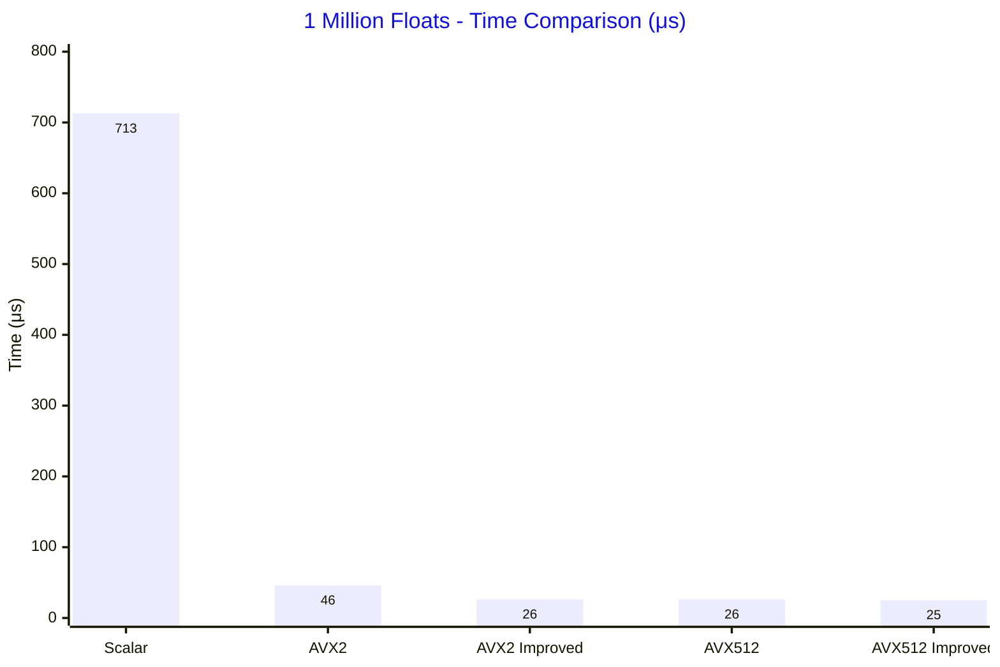
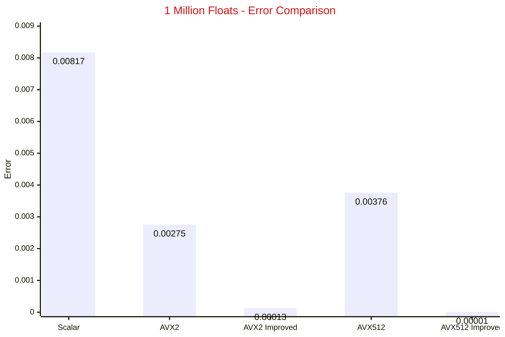
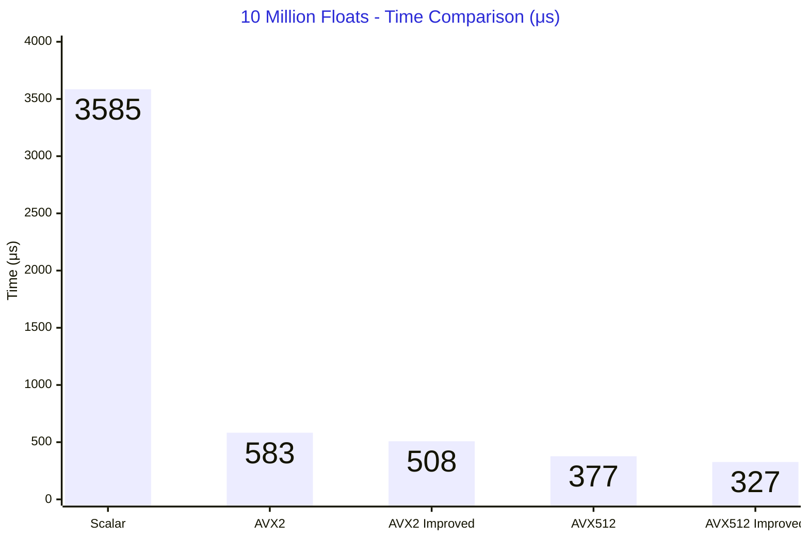
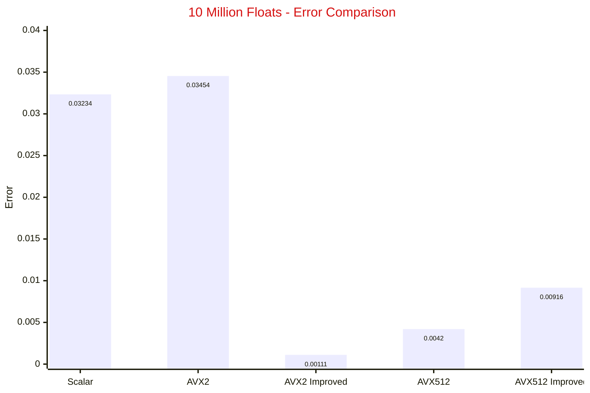
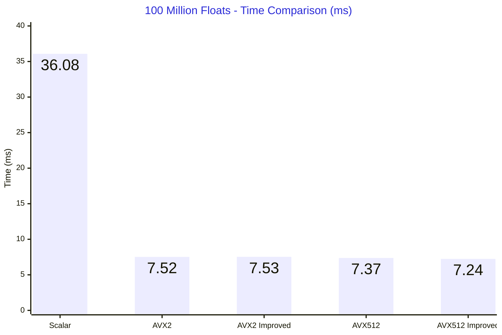
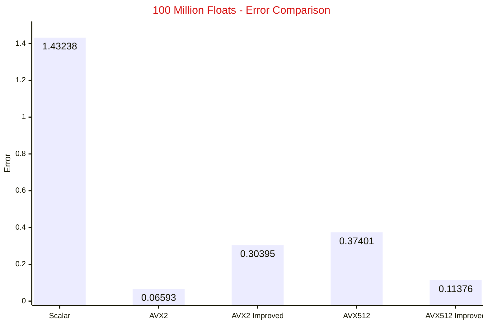

# SIMD Benchmark Results

---

## 1 Million Floats

Reference double precision: 122.4638115764

| Method              | Value          | Error         | Time  |
| ------------------- | -------------- | ------------- | ----- |
| Scalar f32          | 122.4719848633 | 0.0081732869 | 713µs |
| AVX2 f32            | 122.4610595703 | 0.0027520061  | 46µs  |
| AVX2 Improved f32   | 122.4636840820 | 0.0001274943  | 26µs  |
| AVX512 f32          | 122.4600524902 | 0.0037590861  | 26µs  |
| AVX512 Improved f32 | 122.4638061523 | 0.0000054240  | 25µs  |

## 10 millions floats

Reference double precision: 514.2297281623

| Method              | Value          | Error         | Time   |
| ------------------- | -------------- | ------------- | ------ |
| Scalar f32          | 514.1973876953 | 0.0323404670  | 3585µs |
| AVX2 f32            | 514.1951904297 | 0.0345377326  | 583µs  |
| AVX2 Improved f32   | 514.2308349609 | 0.0011067986 | 508µs  |
| AVX512 f32          | 514.2255249023 | 0.0042032599  | 377µs  |
| AVX512 Improved f32 | 514.2388916016 | 0.0091634393 | 327µs  |

## 100 millions floats (L3 cache is not enough, maybe cpu downclock)

Reference double precision: 2721.9301657081

| Method              | Value           | Error         | Time    |
| ------------------- | --------------- | ------------- | ------- |
| Scalar f32          | 2723.3625488281 | 1.4323831201 | 36077µs |
| AVX2 f32            | 2721.9960937500 | 0.0659280419 | 7517µs  |
| AVX2 Improved f32   | 2721.6262207031 | 0.3039450049  | 7527µs  |
| AVX512 f32          | 2721.5561523438 | 0.3740133643  | 7372µs  |
| AVX512 Improved f32 | 2721.8164062500 | 0.1137594581  | 7241µs  |

